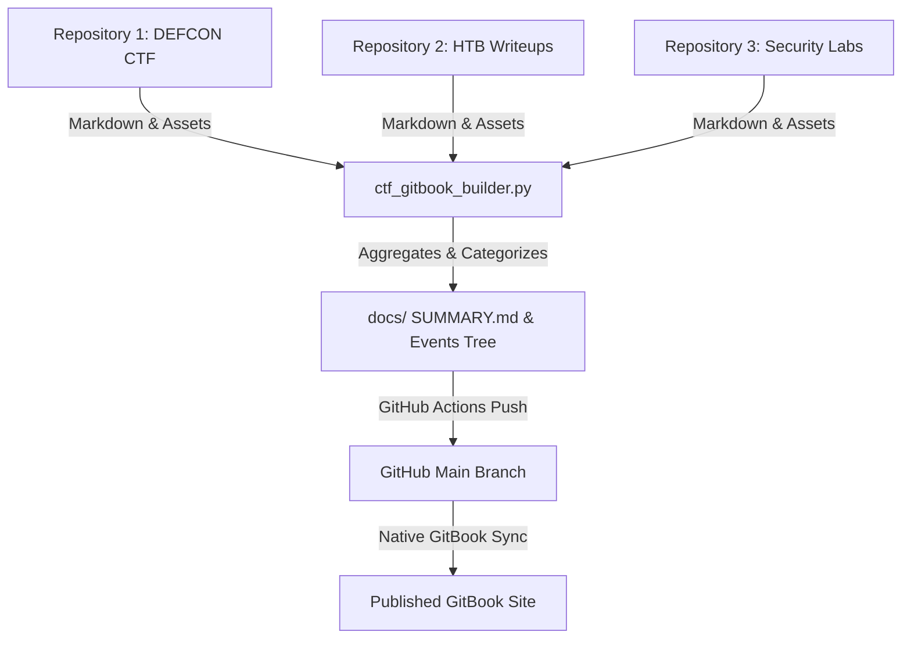

# 🚩 MoriartyPuth Labs - CTF Writeup GitBook Sync Engine

An automated aggregation & synchronization tool that collects CTF writeups and security research across repositories in **[MoriartyPuth-Labs](https://github.com/MoriartyPuth-Labs)** and builds a unified, beautifully structured **GitBook Cybersecurity Blog**.

---

## 🌟 How It Works



---

## 🗂️ Generated GitBook Hierarchy

The generator automatically builds a nested table of contents for GitBook organized by **CTF Event → Category → Challenge**:

```text
docs/
├── README.md                  # Homepage & global blog stats
├── SUMMARY.md                 # GitBook Table of Contents
└── events/
    ├── defcon-ctf-2024/
    │   ├── README.md          # Event Overview
    │   ├── web/
    │   │   ├── README.md      # Web Category Index
    │   │   ├── challenge-1.md
    │   │   └── assets/        # Auto-resolved relative images
    │   └── pwn/
    │       ├── README.md
    │       └── heap-overflow.md
    └── htb-cyber-apocalypse/
        └── ...
```

---

## 🚀 Quick Start Guide

### 1. Local Build & Test
1. Clone this repository:
   ```bash
   git clone https://github.com/MoriartyPuth-Labs/gitbook-blog.git
   cd gitbook-blog
   ```
2. Run the builder script:
   ```bash
   python ctf_gitbook_builder.py
   ```
3. Inspect the generated `docs/` folder and `docs/SUMMARY.md`.

---

## 🔗 Connecting to GitBook

1. Go to your **[GitBook Space / Site](https://app.gitbook.com/o/Tj9gTB2lThcT5X9tS5Cn/sites/site_F1Zbk/s/n3O2YXxts5B6nQyXERqU/)**.
2. Click **Git Sync** in the left sidebar or top settings menu.
3. Select **GitHub** and choose the repo (e.g. `MoriartyPuth-Labs/gitbook-blog`).
4. Set the **Root Folder** parameter to `docs/` (or `/docs`).
5. Choose branch `main`.
6. Save and Sync! GitBook will automatically render your writeups and `SUMMARY.md` navigation bar.

---

## 📝 Writing Standardized Writeups

To get the cleanest results, format your writeups with YAML frontmatter metadata at the top of markdown files:

```markdown
---
title: "SQL Injection Bypass"
event: "DEFCON CTF 2024"
category: "Web"
points: 500
author: "MoriartyPuth"
---

# SQL Injection Bypass

## Challenge Overview
Detailed explanation here...


```

> **Fallback Note**: If frontmatter is missing, the tool automatically detects the title from the first `# H1` header and infers the category and event from folder names (e.g. `/web/`, `/pwn/`, `/crypto/`).
